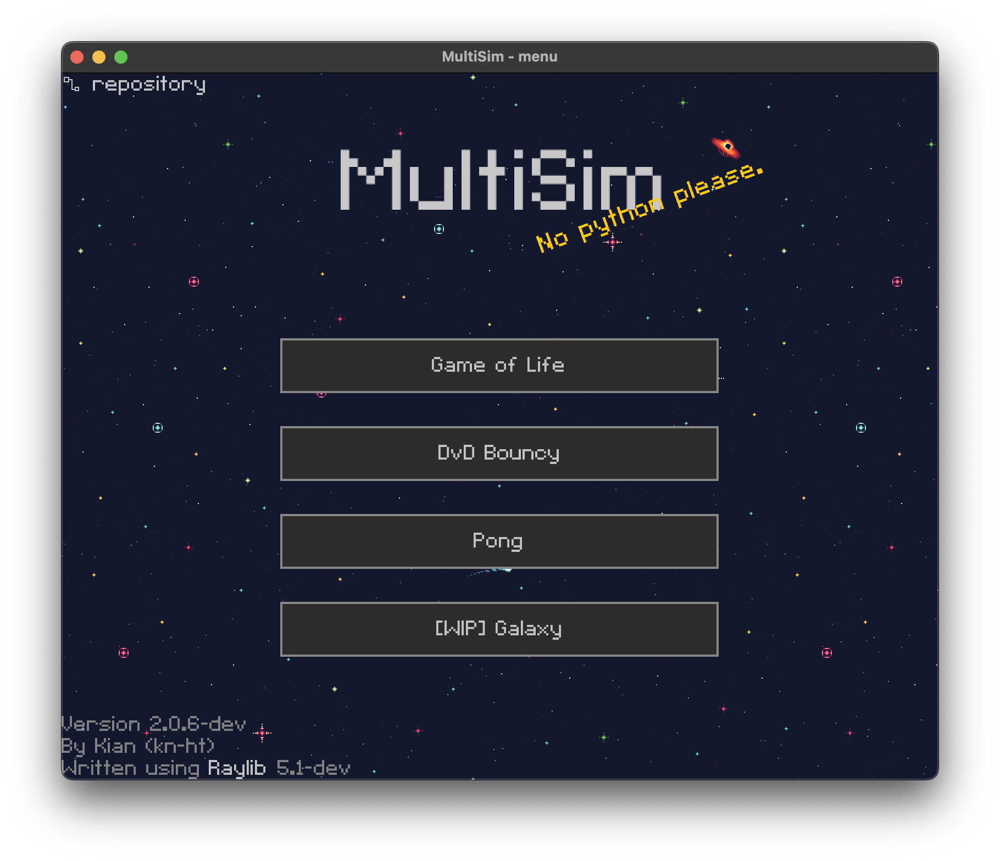

# MultiSim  
##### *A game collection written in C using [Raylib](https://raylib.com)*.  



#### List of Games
- [Game of Life](https://en.wikipedia.org/wiki/Conway%27s_Game_of_Life)
- [DvD bouncing sim](https://knowyourmeme.com/memes/bouncing-dvd-logo)
- [Pong](https://en.wikipedia.org/wiki/Pong)
- **(WIP)** [Minecraf](https://minecraft.net) Clone

---
## Structure  
```
├── LICENSE                     // The License for the project  
├── Legacy-rust-version         // The legacy rust code, which has been ported C
├── README.md                   // The README file that's displayed here  
├── assets                      // Assets included in the project (font, images, etc.)  
│   ├── CnC-RedAlert.ttf        // The font used in the project
│   ├── DVD_logo.png            // Logo for the dvd game
│   ├── beep.wav                // Beep sound used in pong
│   ├── bolus.png               // Easter egg for Game of Life
│   ├── icon                    // The window/desktop icons 
│   │   ├── ...  
│   └── menu-bg.png             // The background image for the main menu
├── include                     // The files from libraries used, primarily from raylib (https://www.raylib.com)
│   ├── ...  
├── lib                         // The static libraries used in linking the final executable.
│   ├── WIN32                   // Compiled for Windows
│   │   └── libraylib.a  
│   ├── macos                   // Compiled for MacOS
│   │   └── libraylib.a  
├── Makefile                   !// Build system, run `make` to compile.
├── src                         // The directory containing original source code.
│   ├── const.h                !// Constants, constant initializers and macro's
│   ├── dvd                     // DvD game
│   │   └── dvd.c               // DvD game logic  
│   ├── external                // External headers
│   │   └── incbin.h            // "Include binary files with ease", from https://github.com/graphitemaster/incbin
│   ├── galaxy                  // Galaxy game
│   │   ├── galaxy.c            // Galaxy game logic
│   │   └── galaxy.h            // Galaxy game header/constants
│   ├── gamestate.h            !// managed global state
│   ├── gol                     // Game of Life game
│   │   ├── cell.c              // Game of Life cell definition
│   │   ├── game.c              // Game of Life game logic
│   │   ├── theme.c             // Game of Life theme definitions
│   │   └── universe.c          // Game of Life universe (dynamic array) implementation
│   ├── main.c                 !// Main file, program executes from here.
│   ├── panic.h                !// Global error handling & cleanup
│   ├── minesweeper             // Minesweeper game
│   │   └── minesweeper.c       // Minesweeper game logic
│   ├── pong                    // Pong game
│   │   ├── ball.h              // Pong Ball struct and constants 
│   │   ├── paddle.h            // Pong Paddle constants
│   │   └── pong.c              // Pong game logic
│   └── ui                      // ui management
│       ├── font.c              // default font used everywhere
│       ├── raygui_incl.h       // (re)include raylib without issues
│       ├── raygui_style_dark.h // Dark mode
│       ├── selector.c         !// The 'selector' that manages and updates the games
│       ├── splashtext.c        // the yellow random text shown next to the title
│       └── windowicon.c        // Load/set the window icon
└── winresource                 // Windows metadata (for example the desktop icon)
    ├── resource.rc             // Windows resource file that sets the metadata (icon etc.)
    └── windres.exe             // Program used to set the window icon
```

### Code Style  
```C
// Structures
typedef struct SomeStruct {
    ...
} SomeStruct;

// "methods" (functions for structs)
SomeStruct somestruct_new() {}
void somestruct_update(SomeStruct* s) {}
```
---
## CONTROLS
- **Escape** to return to the main menu.
---
## INSTALLING  
You can download the exe from the releases tab on the right of the page,  
or you can **build it from source**.  
---
#### Building from source
Before building you need to have installed on your system:  
- [git](https://git-scm.com/book/en/v2/Getting-Started-The-Command-Line)  
- A C compiler. It works out of the box with [Mingw-w64](https://www.mingw-w64.org/), [GCC](https://gcc.gnu.org/) and [Clang](https://clang.llvm.org/).  
- [Gnu Make](https://www.gnu.org/software/make/) to run the `make` command

Then run the following command in your terminal.  
**NOTE**: The compiler variable `CC` defined in the `Makefile` defaults to **gcc**, make sure you modify it or install gcc.
**NOTE**: When cross compiling with mingw, pass **mingw** as an argument to `make`  
```
git clone https://github.com/kn-ht/multisim
cd multisim
make release
```

The compiled executable will be in the ./bin/ folder.
 
